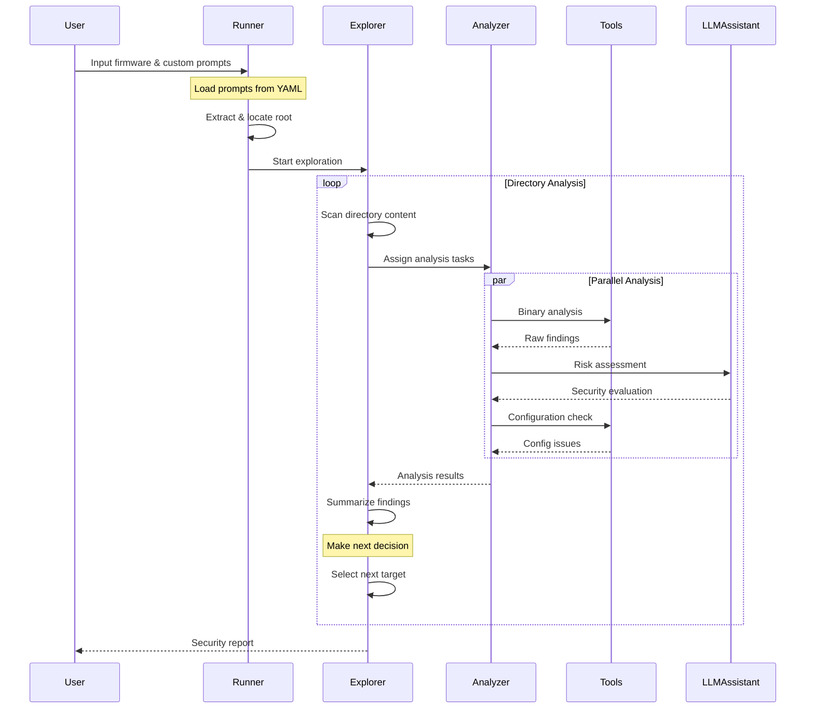

# FirmAnalyzer - Intelligent Firmware Analysis System

## System Architecture

## Core Components

### Main Components
- **main.py** - System entry point and orchestration
- **explore.py** - Firmware filesystem exploration engine
- **analyze.py** - File analysis and security assessment core

### Configuration
- **requirements.yaml**
  - File type definitions and analysis rules
  - Priority directory configurations
  - Security severity criteria
  - Analysis workflow specifications

## Requirements
- Python 3.8+
- radare2 5.9.9 

