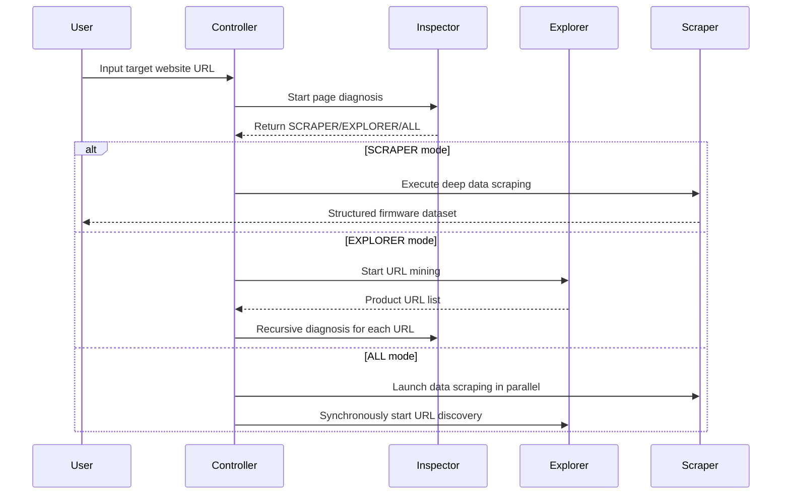

```mermaid
sequenceDiagram
    participant User
    participant Controller
    participant Inspector
    participant Explorer
    participant Scraper
    
    User->>Controller: Input target website URL
    Controller->>Inspector: Start page diagnosis
    Inspector-->>Controller: Return SCRAPER/EXPLORER/ALL
    alt SCRAPER mode
        Controller->>Scraper: Execute deep data scraping
        Scraper-->>User: Structured firmware dataset
    else EXPLORER mode
        Controller->>Explorer: Start URL mining
        Explorer-->>Controller: Product URL list
        Controller->>Inspector: Recursive diagnosis for each URL
    else ALL mode
        Controller->>Scraper: Launch data scraping in parallel
        Controller->>Explorer: Synchronously start URL discovery
    end
```